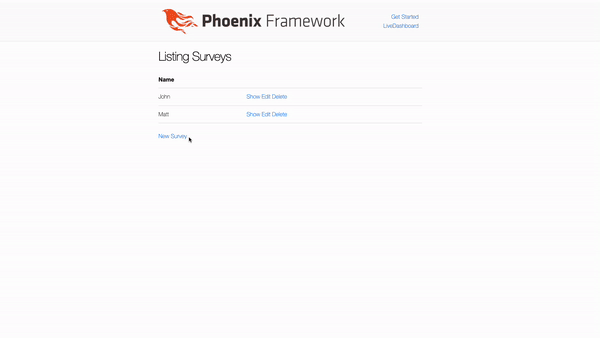

# Dynamic form inputs in Elixir LiveView

I recently found myself addressing a product requirement that involved a form with input fields to be generated from a list of data that we retrieved from a 3rd party provider. This proved challenging as the prescribed user experience stretched a little beyond the familiar tools for form building in elixir.

Even more frustrating, the wireframes prescribed presenting the data as a table with checkboxes for each row, and not a `select_multiple` type element.

To recreate a working minimal example I decided to start my own survey company.



The survey company is responsible for gathering lists of people's favorite animals. We get this list from an external API and then need to allow a user to make a selection on our surveys page.

For simplicity's sake we will only be working with a hardcoded list of strings to represent our external data.

## Modeling the survey

Our survey data is modeled as such:
1. Name
1. Favorite animals

I've added two fields to represent each of our examples from the form. One for a `select multiple` element and one for a `checkbox group` type element.
```elixir
schema "surveys" do
    field :name, :string
    field :favorite_animal_select_multiple, {:array, :string}
    field :favorite_animal_checkbox_group, {:array, :string}

    timestamps()
  end
```
## Structuring the form around the survey schema

Given that list of animal choices is outside of our direct control:
1. How do we represent the form data as a list of strings while presenting the field as a group of checkboxes?
1. How can we use our schema changeset for form validations?


The phoenix documentation has a really nice example on how to implement a similar behavior with a multi-select element (multiple_select/4).
https://hexdocs.pm/phoenix_html/Phoenix.HTML.Form.html#multiple_select/4

```elixir
multiple_select(f, :favorite_animal_select_multiple, [“Phoenix”, “Wallaby”, “Numbat”])
```
Returns the following HTML
```html
<select id="favorite-animals-survey-form_favorite_animal_select_multiple" multiple="" name="survey[favorite_animal_select_multiple][]"><option value="Phoenix">Phoenix</option><option value="Wallaby">Wallaby</option><option value="Numbat">Numbat</option></select>
```


## Generating unserialized inputs 

By default adding a checkbox adds a key to the map that represents the form. If we generated our form inputs in a loop we end up with some html like this.
```elixir
["Phoenix", "Wallaby", "Numbat"] |> Enum.map(&(~s(<input type=”checkbox” name=”#{&1}”>))) |> Enum.join()
```
Returns the following markup:

```elixir
"<input type=”checkbox” name=”Phoenix” value=”Phoenix”>
 <input type=”checkbox” name=”Wallaby” value=”Wallaby”>
 <input type=”checkbox” name=”Numbat” value=”Numbat”>"
 ```

*** In case  you’re not familiar with the `~s()` syntax, we are using a sigil for the convenience of not having to escape the double quotes in the example.

https://elixir-lang.org/getting-started/sigils.html#strings-char-lists-and-word-lists-sigils

This means a map representation of our form grows by one key every time a new animal gets added to our survey.

```elixir
%{
   “Phoenix” => “Phoenix”,
   “Wallaby” => “Wallaby”,
   ”Numbat” => ”Numbat”,
   “Honey Badger” => “Honey Badger”
}
```

This will not work well if we want to use our survey changeset for validations.

Let’s compare the checkbox data against what we get from Phoenix’s select_multiple/4 function.


```elixir
%{
  “Favorite_animal_select_multiple” =>
   [“Phoenix”, “Wallaby”, “Numbat”]
}
```
This data conforms to our schema nicely, so how can we implement this array structure for checkboxes?

There is unfortunately no shortcut here like there is with `select_multiple`, but if we inspect the markup that is generated by this function, we can borrow a few html patterns to group our checkboxes into a single field.


```html
<select id="favorite-animals-survey-form_favorite_animal_select_multiple" multiple="" name="survey[favorite_animal_select_multiple][]"><option value="Phoenix">Phoenix</option><option value="Wallaby">Wallaby</option><option value="Numbat">Numbat</option></select>
```
The name attribute syntax is exactly what we need to model our checkboxes as a collection.

```html
name="survey[favorite_animal_select_multiple][]"
```

We can also group the checkboxes together in html using a `fieldset` element.
```html
<fieldset id="favorite-animals-survey-form_favorite_animal_checkbox_group">
      <label>What is Your Favorite Animal?</label>
      <%= for animal <- @animal_choices do %>
        <input type="checkbox" name="survey[favorite_animal_checkbox_group][]" value={animal} /><%= animal %><br />
      <% end %>
</fieldset>
```

Now when we inspect our form data from the submit event we can see it conforms to the same array type structure as the `select_multiple`.

```elixir
%{
  "favorite_animal_checkbox_group" =>
   ["Phoenix", "Wallaby", "Numbat"]
}
```
## Using a changeset to display errors
Now that we have our form fields passing the correct data structure to the back end we still need to validate it and show errors to the user. We can do so by adding an error tag.

```elixir
<%= error_tag(f, :favorite_animal_checkbox_group) %>
```

This leaves our entire form component looking as such in the template
```elixir
<.form
    let={f}
    for={@changeset}
    id="favorite-animals-survey-form"
    phx-target={@myself}
    phx-submit="save"
  >
    <%= label(f, :name) %>
    <%= text_input(f, :name) %>
    <%= error_tag(f, :name) %>
    <label>What is Your Favorite Animal?</label>
    <%= multiple_select(f, :favorite_animal_select_multiple, @animal_choices) %>
    <fieldset id="favorite-animals-survey-form_favorite_animal_checkbox_group">
      <label>What is Your Favorite Animal?</label>
      <%= for animal <- @animal_choices do %>
        <input type="checkbox" name="survey[favorite_animal_checkbox_group][]" value={animal} /><%= animal %><br />
      <% end %>

      <%= error_tag(f, :favorite_animal_checkbox_group) %>
    </fieldset>
    <div>
      <%= submit("Save", phx_disable_with: "Saving...") %>
    </div>
  </.form>
```
And our handle_event for form submit
```elixir
def handle_event("save", %{"survey" => survey_params}, socket) do
    save_survey(socket, socket.assigns.action, survey_params)
end

 defp save_survey(socket, :new, survey_params) do
    case Surveys.create_survey(survey_params) do
      {:ok, _survey} ->
        {:noreply,
         socket
         |> put_flash(:info, "Survey created successfully")
         |> push_redirect(to: socket.assigns.return_to)}

      {:error, %Ecto.Changeset{} = changeset} ->
        {:noreply, assign(socket, changeset: changeset)}
    end
  end
```

Resources: 
https://github.com/thejohncotton/dynamic-form-inputs-example